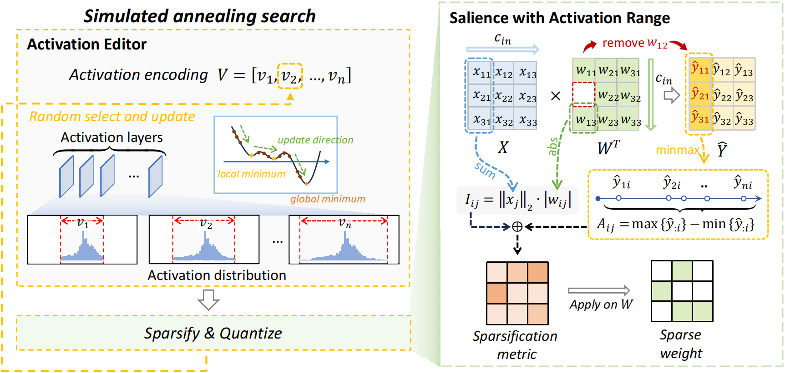

# JSQ: Compressing Large Language Models by Joint Sparsification and Quantization

[[paper]([openreview.net/pdf?id=sCGRhnuMUJ](https://openreview.net/pdf?id=sCGRhnuMUJ))]



**JSQ** is a joint compression method for large language models that effectively combines sparsification and quantization to achieve very little performance loss at high compression rates.

## Installation

```sh
conda create -n jsq python=3.10 -y
conda activate jsq
git clone https://github.com/uanu2002/JSQ.git
cd JSQ
pip install --upgrade pip 
pip install transformers accelerate datasets
```

## Usage

### Compression

```sh 
python main.py
```

### Evaluation

We use [EleutherAI/lm-evaluation-harness: A framework for few-shot evaluation of language models. (github.com)](https://github.com/EleutherAI/lm-evaluation-harness) as an evaluation tool.

## Citation

If you find JSQ useful or relevant to your research, please kindly cite our paper:

```bibtex
@InProceedings{pmlr-v235-guo24g,
      title = {Compressing Large Language Models by Joint Sparsification and Quantization},
      author = {Guo, Jinyang and Wu, Jianyu and Wang, Zining and Liu, Jiaheng and Yang, Ge and Ding, Yifu and Gong, Ruihao and Qin, Haotong and Liu, Xianglong},
      booktitle = {Proceedings of the 41st International Conference on Machine Learning},
      pages = {16945--16957},
      year = {2024}
}
```
